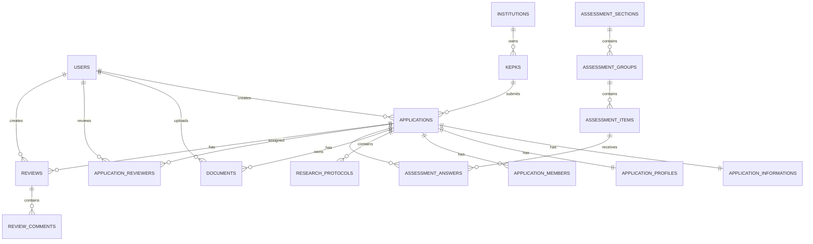

# Entity Relationship Diagram

```mermaid
erDiagram
    USERS ||--o{ APPLICATIONS : creates
    INSTITUTIONS ||--o{ KEPKS : owns
    KEPKS ||--o{ APPLICATIONS : submits
    APPLICATIONS ||--|| APPLICATION_INFORMATIONS : has
    APPLICATIONS ||--|| APPLICATION_PROFILES : has
    APPLICATIONS ||--o{ APPLICATION_MEMBERS : has
    APPLICATIONS ||--o{ RESEARCH_PROTOCOLS : contains
    APPLICATIONS ||--o{ DOCUMENTS : owns
    ASSESSMENT_SECTIONS ||--o{ ASSESSMENT_GROUPS : contains
    ASSESSMENT_GROUPS ||--o{ ASSESSMENT_ITEMS : contains
    APPLICATIONS ||--o{ ASSESSMENT_ANSWERS : has
    ASSESSMENT_ITEMS ||--o{ ASSESSMENT_ANSWERS : receives
    USERS ||--o{ DOCUMENTS : uploads
    APPLICATIONS ||--o{ APPLICATION_REVIEWERS : assigned
    USERS ||--o{ APPLICATION_REVIEWERS : reviews
    APPLICATIONS ||--o{ REVIEWS : has
    USERS ||--o{ REVIEWS : creates
    REVIEWS ||--o{ REVIEW_COMMENTS : contains
```
